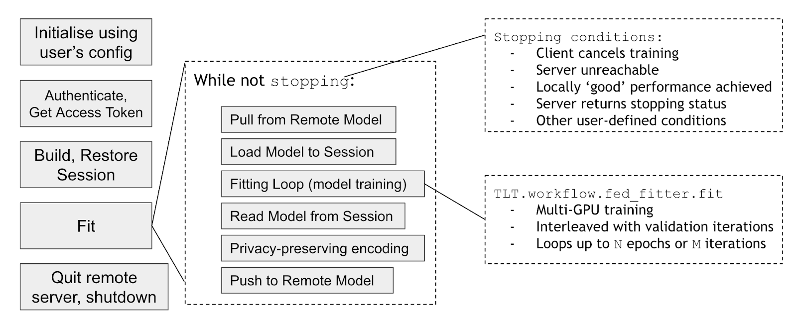

# Federated Learning with Clara Train SDK

Medical data is sensitive and needs to be protected. And even after anonymization processes, 
it is often infeasible to collect and share patient data from several institutions in a centralised data lake. 
This poses challenges for training machine learning algorithms, such as deep convolutional networks, which require extensive and balanced data sets for training and validation.

Federated learning (FL) is a learning paradigm that sidesteps this difficulty: 
instead of pooling the data, the machine learning process is executed locally at each participating institution and only intermediate model training updates are shared among them. 
It thereby allows to train algorithms collaboratively without exchanging the underlying datasets and neatly addresses the problem of data governance and privacy that arise when pooling medical data. 
There are different FL communication architectures, such as the Client-server approach via hub and spokes, a decentralized architecture via peer-to-peer or hybrid variants. 

The FL tool in the Clara Train SDK is a client-server architecture, 
in which a federated server manages the aggregation and distribution as shown below.
   

## Prerequisites
- None. This note book explains FL.

### Resources
- Watch talk covering Clara Train SDK basics [S22563](https://developer.nvidia.com/gtc/2020/video/S22563)
Clara train Getting started: cover basics, BYOC, AIAA, AutoML 
- GTC 2020 talk [Federated Learning for Medical Imaging: Collaborative AI without Sharing Patient Data](https://developer.nvidia.com/gtc/2020/video/s21536-vid)
- [Federated learning blog](https://blogs.nvidia.com/blog/2019/10/13/what-is-federated-learning/)
- [Federated learning blog at RSNA](https://blogs.nvidia.com/blog/2019/12/01/clara-federated-learning/)  

# Overview

Federated Learning in Clara Train SDK uses a client-server architecture. 
The image below gives you an overview. 
For details about the components, please see our [documentation](https://docs.nvidia.com/clara/tlt-mi/clara-train-sdk-v3.0/nvmidl/additional_features/federated_learning.html?highlight=federated).  

The key things to note are:
* A server is responsible for **managing training, keeping best model and aggregating gradients**.
* Clients are responsible for **training local model** and sending updates (gradients) to server.
* **No data from the dataset is shared** between clients or with server.
* To ensure **privacy**, all communication with server is secured.
* Additional privacy-preserving mechanisms can be enabled.

Figure below shows these concepts and how they are communicated to the server.
  

## Server

The following diagram shows the server workflow:

  

A federated server is responsible for:
1. Initialising a global model at federated round 0
1. Sharing the global model with all clients
1. Synchronising model updates from multiple clients
1. Updating the global model when sufficient model updates received

##  Client

The following diagram shows the client workflow:
  

A federated client will:
1. Download the global model
1. Train the model with local training data
1. Upload `delta_w` (the difference between the updated model and the global model) to the server

# FL Challenges 
In order to run a federated learning experiment, you need think about:
1. Software development:
    1. Security:
        1. Secure connection
        2. Authentication
        3. Certification ssl
    2. Deadlocks: Clients join / die / re-join
    4. Unstable client server connection
    5. Scaling: How to run large FL experiment with 20 or 100 clients
    6. With different sites having different data size, how to enable local training with multiple GPUs, also how to give weights to different clients.
    7. Audit trails: clients need to know who did what, when    

2. Logistics: (Most challenging)

    1. FL experiment is typically conducted through multiple experiments to tune hyper parameters. 
    How to synchronize these runs
    2. Keep track of experiments across sites.
    3. FL most important feature is to improve the off diagonal metric. 
    Clients would share results (validation metric) and NOT the data. 
     This is the hardest to do  since you need to distribute the models from each client to the rest.  

3. Research:
    1. How to aggregate model weights from each site
    2. Privacy for your model weight sharing 
    

Clara software engineers have taken care of the 1st and 2nd bullets for you so researchers can focus on the 3rd bullet.
Moreover, In Clara train V3.1, FL comes with a new provisioning tool what simplifies the process.

Lets start by defining some terminologies used throughout FL discussion:

- __Study__: An FL project with preset goals (e.g. train the EXAM model) and identified participants.
- __Org__: The organization that participates in the study.
- __Site__: The computing system that runs FL application as part of the study.
There are two kinds of sites: Server and Clients.
Each client belongs to an organization.
- __Provisioning Tool__: The tool used for provisioning all participants of the study.
- __FL Server__: An application responsible for client coordination based on FL federation rules and model aggregation.
- __FL Client__: An application running on a client site that performs model training with its local datasets and collaborates with the FL Server for federated study.
- __Admin Client__: An application running on a user’s machine that allows the user to perform FL system operations with a command line interface.
- __Lead IT__: The person responsible for provisioning the participants and coordinating IT personnel from all sites for the study.
The Lead IT is also responsible for the management of the Server.
- __Site IT__: The person responsible for the management of the Site of his/her organization.
- __Lead Researcher__: The scientist who works with Site Scientists to ensure the success of the study.
- __Site Researcher__: The scientist who works with the Lead Scientist to make sure the Site is properly prepared for the study.

NOTE: in certain projects, a person could play several of the above-mentioned roles. 
  

Diagram above shows high level steps of an FL study:  
1. Lead IT configures everything in a config.yaml file, runs provisioning which will generate zip packages for each client.
2. These packages contains everything a FL clients needs from starting the docker, ssl certification, etc to start and complete the FL experiment.
3. Each client starts the docker and the FL client use the provided Startup Kit.
4. Similarly the FL server starts the docker and FL server using the provided Startup Kit.
5. Finally the Admin can either use docker or pip install the admin tool, which will connect to the server and start the FL experiment

## With this in mind we have created 3 sub-notebooks: 
1. [Provisioning](Provisioning.ipynb) which walks you though the configurations you set and how to run the tool
2. [Client](Client.ipynb) walks you through a FL client
3. [Admin](Admin.ipynb) walks you through how the FL admin data scientist would conduct the FL experiment once the server and clients are up and running
 
